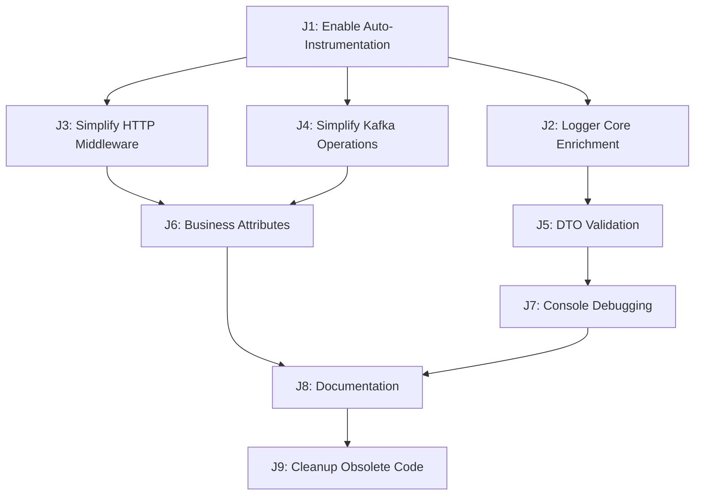

# Task Manager OTEL Tracing & Logging - Job Dependency Manager

## Overview
This file manages the dependencies between all OTEL tracing and logging jobs. Each job is split into its own file for better organization and tracking.

## Job Dependencies

## Job Status Tracking

| Job | File | Status | Dependencies | Priority |
|-----|------|--------|--------------|----------|
| J1 | [01-enable-auto-instrumentation.md](./01-enable-auto-instrumentation.md) | ⏳ Pending | None | 🔴 Critical |
| J2 | [02-logger-core-enrichment.md](./02-logger-core-enrichment.md) | ⏳ Pending | J1 | 🔴 Critical |
| J3 | [03-simplify-http-middleware.md](./03-simplify-http-middleware.md) | ⏳ Pending | J1 | 🟡 Medium |
| J4 | [04-simplify-kafka-operations.md](./04-simplify-kafka-operations.md) | ⏳ Pending | J1 | 🟡 Medium |
| J5 | [05-dto-validation.md](./05-dto-validation.md) | ⏳ Pending | J2 | 🟡 Medium |
| J6 | [06-business-attributes.md](./06-business-attributes.md) | ⏳ Pending | J3, J4 | 🟢 Low |
| J7 | [07-console-debugging.md](./07-console-debugging.md) | ⏳ Pending | J5 | 🟢 Low |
| J8 | [08-documentation.md](./08-documentation.md) | ⏳ Pending | J6, J7 | 🟢 Low |
| J9 | [09-cleanup-obsolete-code.md](./09-cleanup-obsolete-code.md) | ⏳ Pending | J1-J8 | 🟢 Low |

## Implementation Phases

### Phase 1: Foundation (Critical Path)
- **J1**: Enable Auto-Instrumentation
- **J2**: Logger Core Enrichment

### Phase 2: Context Propagation (Medium Priority)
- **J3**: Simplify HTTP Middleware
- **J4**: Simplify Kafka Operations
- **J5**: DTO Validation

### Phase 3: Enhancement (Low Priority)
- **J6**: Business Attributes
- **J7**: Console Debugging
- **J8**: Documentation

### Phase 4: Cleanup (Final)
- **J9**: Cleanup Obsolete Code

## Quick Start Guide

1. **Start with J1**: Enable auto-instrumentation first
2. **Then J2**: Update logger to extract trace context
3. **Continue with J3-J4**: Simplify HTTP and Kafka operations
4. **Complete with J5-J8**: Add validation, attributes, and documentation
5. **Finish with J9**: Clean up obsolete code and artifacts

## Status Legend
- ⏳ Pending
- 🔄 In Progress
- ✅ Completed
- ❌ Blocked
- ⚠️ Needs Review

## Notes
- Update the status in each job file as you complete them
- Each job file contains detailed implementation steps
- Dependencies must be completed before starting dependent jobs
- All jobs should be completed for full OTEL integration
- J9 (Cleanup) should be done last to remove obsolete code
