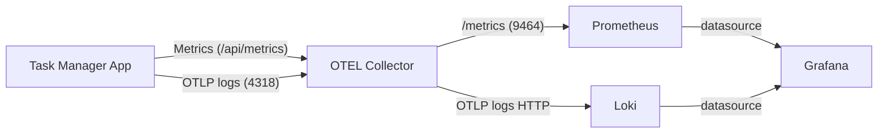

# J6 - OpenTelemetry Logs SDK Integration and Loki Pipeline Verification

## Goal

Migrate `task-manager` logging to the official OpenTelemetry Logs SDK so that logs flow strictly as: application → OTEL Collector → Loki (no file writers, no direct-to-Loki). Preserve readable console output. Ensure metrics remain: OTEL Collector scrapes the app; Prometheus scrapes the Collector.

## High-Level Overview

- Replace manual `OTLPLogExporter.export()` usage with the OTEL Logs SDK (`LoggerProvider` + `BatchLogRecordProcessor` + `OTLPLogExporter`).
- Set a proper `Resource` with `service.name = task-manager` so logs are labeled consistently in Loki/Grafana.
- Confirm Loki is configured to accept structured metadata (schema v13 + tsdb) or alternatively ensure the Collector strips structured metadata if necessary.
- Keep console logs clean and readable per team preferences; send the same events to the Collector.
- Validate end-to-end by generating logs and querying Loki via HTTP API.

## Scope of Changes

- Files:
  - `apps/task-manager/src/common/utils/loggers/otel-logger.ts` (migrate to Logs SDK)
  - `apps/task-manager/src/common/utils/loggers/logger-factory.ts` (no functional change; confirm `SERVICE_NAME` env used)
  - No changes to application business logic.
- Config (review only; no change unless noted):
  - `deployment/observability/configs/otel-collector.yaml` (logs via `otlphttp` to `http://loki:3100/otlp`, resource processor upserts `service.name`)
  - `deployment/observability/configs/loki.yaml` (schema v13 + tsdb; `allow_structured_metadata: true` if using native OTLP structured metadata)
  - `deployment/observability/configs/prometheus.yml` (Prometheus scrapes only the Collector `:9464`)

## Packages to Install (workspace root)

```bash
npm i -D @opentelemetry/sdk-logs @opentelemetry/resources @opentelemetry/semantic-conventions
```

## Interface-First Definitions

- Logger console methods remain:
  - `info(message: string, meta?: any): void`
  - `error(message: string, meta?: any): void`
  - `warn(message: string, meta?: any): void`
  - `debug(message: string, meta?: any): void`
  - `success(message: string, meta?: any): void`
- OTEL Logs SDK integration will be internal to `OtelLogger` and should not change the public interface.

## Input/Output Contract Definitions

- Input: application log events via `OtelLogger` methods.
- Output:
  - Console log lines: `[LEVEL] [Task Manager] [timestamp]: message` (unchanged visual format)
  - OTLP logs: exported via HTTP to OTEL Collector at `${OTEL_EXPORTER_OTLP_ENDPOINT || 'http://localhost:4318'}/v1/logs` with resource attribute `service.name = task-manager` and minimal attributes.

## Pseudocode-Driven Instructions

```pseudo
// init once (singleton inside OtelLogger)
import { LoggerProvider } from '@opentelemetry/sdk-logs'
import { BatchLogRecordProcessor } from '@opentelemetry/sdk-logs'
import { Resource } from '@opentelemetry/resources'
import { SemanticResourceAttributes } from '@opentelemetry/semantic-conventions'
import { OTLPLogExporter } from '@opentelemetry/exporter-logs-otlp-http'

endpoint = process.env.OTEL_EXPORTER_OTLP_ENDPOINT || 'http://localhost:4318'
resource = new Resource({
  [SemanticResourceAttributes.SERVICE_NAME]: 'task-manager',
})

provider = new LoggerProvider({ resource })
exporter = new OTLPLogExporter({ url: `${endpoint}/v1/logs`, headers: {}, timeoutMillis: 30000 })
processor = new BatchLogRecordProcessor(exporter)
provider.addLogRecordProcessor(processor)

sdkLogger = provider.getLogger('task-manager')

function sendToOtel(level: 'info'|'warn'|'error'|'debug'|'success', message: string) {
  // Map level to OTEL severity if desired. Minimal attributes to avoid Loki rejections
  sdkLogger.emit({
    body: message,
    severityText: UPPER(level),
  })
}

// console logging unchanged, call sendToOtel asynchronously without blocking
```

## Code Edits

- `apps/task-manager/src/common/utils/loggers/otel-logger.ts`:
  - Create and cache a `LoggerProvider` with `Resource(service.name='task-manager')`.
  - Attach a `BatchLogRecordProcessor` with `OTLPLogExporter` to `${OTEL_EXPORTER_OTLP_ENDPOINT}/v1/logs`.
  - Replace the current manual `OTLPLogExporter.export([logRecord])` call with `sdkLogger.emit({ ... })`.
  - Keep console formatting exactly as-is.
  - Ensure methods remain `void` and never await the OTEL pipeline (fire-and-forget with internal buffering).

## Metrics Flow Review (Pre-Work Check)

Current setup is correct for the desired model:

- OTEL Collector scrapes the app:
  - `receivers.prometheus.config.scrape_configs[0]` → target `host.docker.internal:3000` at path `/api/metrics`.
- Prometheus scrapes the Collector:
  - Prometheus job configured to scrape `otel-collector:9464` (no direct app scrape).
- Collector exports metrics via `exporters.prometheus` at `0.0.0.0:9464`.

Recommendations (optional, not required to proceed):

- Remove demo `const_labels` from `exporters.prometheus` to keep series clean.
- Consider `scrape_timeout: 10s` (<= `scrape_interval`) to avoid stuck scrapes in edge cases.

## State Diagram (reference)



## Validation Steps

1. Start observability services

```powershell
docker compose -f deployment/observability/docker-compose.yml up -d loki otel-collector grafana prometheus
```

2. Start the app

```powershell
npx --yes nx serve task-manager
```

3. Generate activity

```powershell
Invoke-WebRequest -Uri "http://localhost:3000/api/metrics" -Method GET | Out-Null
Invoke-WebRequest -Uri "http://localhost:3000/api/metrics/json" -Method GET | Out-Null
```

4. Verify Collector logs pipeline is healthy (no 400 to Loki)

```powershell
docker logs otel-collector --since 2m
```

5. Verify Loki has labels and entries

```powershell
Invoke-WebRequest -Uri "http://localhost:3100/loki/api/v1/labels" -Method GET
Invoke-WebRequest -Uri "http://localhost:3100/loki/api/v1/series?match[]={service_name=\"task-manager\"}&start=$( [int][double]::Parse((Get-Date -Date (Get-Date).AddMinutes(-5) -UFormat %s)) * 1e9 )" -Method GET
```

## Success Criteria

- Console logs appear unchanged.
- OTEL Collector logs show successful logs export to Loki (no 400 InvalidArgument).
- Loki HTTP API exposes label `service_name` and series for `task-manager` with recent entries.
- Prometheus shows metrics from `otel-collector:9464`; no direct app scrape in Prometheus.

## Rollback Plan

- Revert `apps/task-manager/src/common/utils/loggers/otel-logger.ts` to previous implementation.
- No infrastructure changes required.

## Notes on Logging Minimalism

- Maintain minimal log policy for normal flow. Avoid verbose debug unless `LOG_LEVEL=debug`.
- Continue single arrival/done messages with UUID when applicable, and clear error context.

---

## Coder Agent Work Instructions

<xml>
  <goal>Integrate the official OpenTelemetry Logs SDK in `OtelLogger` so logs go app → OTEL Collector → Loki, and verify end-to-end without any file writers.</goal>
  <packages>
    <install workspace-root="true">
      @opentelemetry/sdk-logs @opentelemetry/resources @opentelemetry/semantic-conventions
    </install>
  </packages>
  <edits>
    <file path="apps/task-manager/src/common/utils/loggers/otel-logger.ts">
      <change>
        - Import and initialize `LoggerProvider`, `BatchLogRecordProcessor`, `Resource`, `SemanticResourceAttributes`, and use `OTLPLogExporter` as the processor exporter.
      </change>
      <change>
        - Create a singleton provider with `Resource({ service.name: 'task-manager' })`.
      </change>
      <change>
        - Replace the manual `export([...])` path with `sdkLogger.emit({ body, severityText })` in `sendToOtel`.
      </change>
      <change>
        - Keep console formatting logic unchanged.
      </change>
      <change>
        - Do not await SDK operations; methods remain `void`.
      </change>
    </file>
  </edits>
  <env>
    <var name="OTEL_EXPORTER_OTLP_ENDPOINT" default="http://localhost:4318" />
    <var name="SERVICE_NAME" default="Task Manager" />
  </env>
  <verification>
    <step>Ensure `docker ps` shows `loki`, `otel-collector`, `prometheus`, `grafana` up.</step>
    <step>Start app: `npx --yes nx serve task-manager`.</step>
    <step>Trigger endpoints: `/api/metrics`, `/api/metrics/json`.</step>
    <step>Check Collector: `docker logs otel-collector --since 2m` (no 400 to Loki).</step>
    <step>Check Loki labels: `GET http://localhost:3100/loki/api/v1/labels`</step>
    <step>Check Loki series: `GET http://localhost:3100/loki/api/v1/series?match[]={service_name=\"task-manager\"}`</step>
  </verification>
  <doneWhen>
    Console logs preserved, Collector exports logs without errors, Loki shows `service_name=task-manager` series with entries, Prometheus reads metrics from Collector only.</doneWhen>
</xml>
